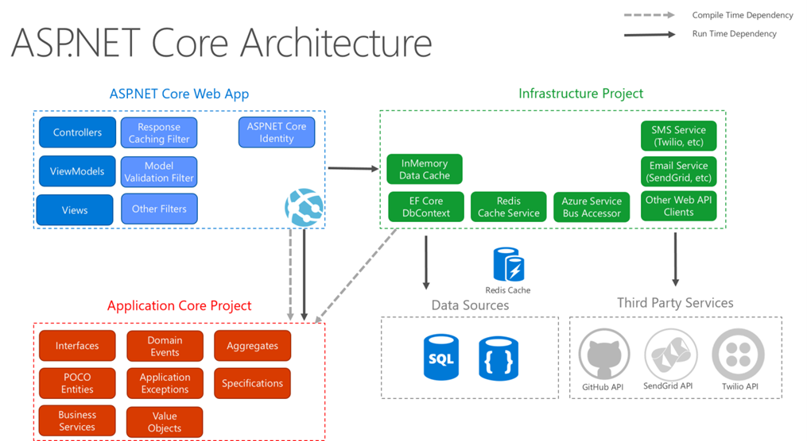

Architecture
=====================
The architecture is built upon the clean architecture but with a specific approach to web applications. 
This means that the project is not using a domain layer to handle all the domain logic. 
This instead is handled in the application layer. 
An overall thought on the application can be viewed in figure 1 below.

*Figure 1 ASP.NET Core Architecture (Microsoft, 2023)*

The application is also using a CQRS pattern (Command and query responsibility segregation) which means that the application has separate endpoints for handling data storage and queries. 
By doing this the application gets a segregation between business logic for example validation and logic needed for the data storage and simple queries which makes object mapping simpler and cleaner. 

Overview of the architecture layers
----------------------
The architectural design consists of three layers which is the API, Application, Infrastructure layer and the Web application. 
The API is responsible for all the startup procedures and the endpoints. 
As the application holds two different applications in the same solution the project is also having some shared projects such as the database project and the integration project. 

API
----------------------
The API is the receiving end of all the communication from the frontend application. 

Middleware’s
~~~~~~~~~~~~~~~~~~~~~
Valghalla is having four different middleware’s that is doing logic in a specific order before the actual application logic is being handled in the application. The four different middleware’s are described here.

*	UserContextHandlingMiddleware. Has the responsibility to set a UserContext based on the claims from the given token. As the claims in the token doesn’t hold information about the user from Valghalla the middleware adds this information to the user context. This context can later be used in the application to know which user is doing all the request. 

*	UserRequestHandlingMiddleware. This middleware is responsible to log all the request that comes to the application and from what user. 

*	TenantContextMiddleware. This middleware is responsible to determine which tenant the requests come from and selects the correct database based on the given address. 

*	GlobalExceptionHandlingMiddleware. This middleware handles all the exceptions in the application and masks all the information that is being returned to the UI. It is also logging the full exception to the correct log file. 

Application
-------------------
This is the business logic layer that should handle all the logic inside of the application. As the system is being module based each module have its own folder containing all the commands and queries in the system. Each command/query is its own file and has its own validation using the library fluent validation. 

Infrastructure
-------------------
This layer handles all the communications towards the database and its main purpose is to deliver the minimal data that is needed for each request. To help with the communication towards the database the application is using entity framework. 

Web
-------------------
Contains the Angular applications which is the frontend application. The application is using lazy loading to only load the specific modules that is needed at the time. The application was generated on version 14 of angular and later upgraded to version 15. The web is later hosted on wwwroot under the API. 
The application is following a module based pattern where each main pages is one module. 

3rd party dependencies
-------------------

OS2Valghalla uses the following 3rd party dependencies:

.. table:: 
================= ===================================================================================================  ========================================================================= ============================== ==============
Component         Use                                                                                                  Reference                                                                 License                        Version
================= ===================================================================================================  ========================================================================= ============================== ==============
RabbitMQ          Queue                                                                                                https://www.rabbitmq.com/                                                 Mozilla Public License 2.0     3.12.5
PostgreSQL        Persistent data storage                                                                              https://www.postgresql.org/                                               PostgreSQL License             15
Docker            Virtualization software                                                                              https://www.docker.com/                                                   Apache License 2.0             24.0.6
EF Core           Object Relatrional Mapper to the database                                                            https://learn.microsoft.com/en-us/ef/core/                                MIT                            7.09
MediatR           Mediates communication                                                                               https://github.com/jbogard/MediatR                                        Apache-2.0                     12.0.1
ITfoxtec          SAML 2.0 integration                                                                                 https://www.itfoxtec.com/IdentitySaml2                                    BSD-3-Clause                   4.8.6
Fluent validation Validates commands and queries                                                                       https://fluentvalidation.net/                                             Apache-2.0                     11.0
Automapper        Maps objects                                                                                         https://automapper.org/                                                   MIT                            12.0.1
Serilog           Logging helper                                                                                       https://github.com/serilog/serilog/aspnetcore/                            Apache-2.0                     7.0.0
MailKit           SMTP client                                                                                          http://www.mimekit.net/                                                   MIT                            4.2.0
MassTransit       Abstraction layer to easier code against RabbitMQ.                                                   https://masstransit.io/                                                   Apache-2.0                     8.0.16
Angular           Frontend framework                                                                                   https://angular.io/                                                       MIT                            15.0.5
Angular Material  Angular design system                                                                                https://material.angular.io/                                              MIT                            15.0.3
SubSink           Handle subscription                                                                                  https://github.com/wardbell/subsink                                       MIT                            1.0.2                                                                                
Transloco         Internationalization                                                                                 https://github.com/ngneat/transloco                                       MIT                            4.2.1
designsystem.dk   Danish design system                                                                                 https://designsystem.dk/                        
NetArchTest       Architecture tests                                                                                   https://github.com/BenMorris/NetArchTest                                  MIT                            1.3.2 
HealthChecks      Help library for health HealthChecks                                                                 https://github.com/Xabaril/AspNetCore.Diagnostics.HealthChecks            Apache-2.0                     7.0.2
Dynamic Linq      Helps with LINQ                                                                                      https://dynamic-linq.net/                                                 Apache-2.0                     1.3.2
ngx-editor        Rich text editor                                                                                     https://github.com/sibiraj-s/ngx-editor                                   MIT                            15.3.0                                                                              
ngx-file-drop     File drop component                                                                                  https://github.com/georgipeltekov/ngx-file-drop                           MIT                            15.0.0
mat-timepicker    Time picker                                                                                          https://github.com/tonysamperi/ngx-mat-timepicker                         MIT                            15.1.4                                                                              
skeleton-loader   Skeleton loader                                                                                      https://github.com/willmendesneto/ngx-skeleton-loader                     MIT                            7.0.0
xng-breadcrumb    Breadcrumb component                                                                                 https://github.com/udayvunnam/xng-breadcrumb                              MIT                            9.0.0
xlsx              Xlsx file helper                                                                                     https://github.com/SheetJS/sheetjs                                        Apache-2.0                     0.18.5
================= ===================================================================================================  ========================================================================= ============================== ==============

