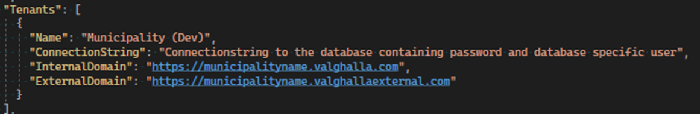

Install new municipalitiy
==================

This document is going to describe the necessary steps to install a new municipality in OS2 Valghalla. 
This is mainly targeted to people working with the system and will describe all the steps to setup a new municipality in an already existing environment. 

Database
----------

Create a new database in the correct environment.  
If using the Valghalla.Tools run the command updateSingle -d “Databasename”. (For more information, read the system documentation about tools)
If not using Valghalla.Tools run all the migrations on the selected database by running dotnet ef database update command with the correct connection string. 

Create a new login on the server specific for that municipality. Then create a user with the same name inside of the newly created database. 
The user should have the roles reader and writer access. Save the password. 

When the database is created go to the secrets,json file. This is a JSON-string that contains all the connections that OS2 Valghalla is using. 
Open that file in Notepad++ and format it to JSON-format. 
The add a new municipality by creating a new object inside of the array. 
Do this with caution, if there is something wrong with the format when uploading the new version this will affect all municipalities. 
The new object should look like the picture below.

DatabaseConnectionString should contain the credentials for the database user that was recently created. 

* ExternalDomain is the address to the external application.
* InternalDomain is the address to the internal application.
* Name is the name of the municipality and is shown in the application.

DNS
--------

Go to the chosen DNS provider and add the specific DNS records for the new municipality. 

Authentication
--------

Use the Valghalla.Tools to insert certificate into the database. 

Configuration
----------

* AppConfiguration.Cvr: The municipalitys CVR code. 
* AppConfiguration.Komkod: The municipalitys Komkod
* AppConfiguration.SMSSender: Sender name when sending out text messages from the system. 
* ExternalAuthConfiguration.Authority: The EntityID from the authentication setup 
* ExternalAuthConfiguration.Issuer: The EntityID from the authentication setup
* ExternalAuthConfiguration.SigningCertificatePassword: The password for the certificate used in the external authentication.
* InternalAuthConfiguration.Authority: The EntityID from the authentication setup
* InternalAuthConfiguration.Issuer: The EntityID from the authentication setup
* InternalAuthConfiguration.SigningCertificatePassword: The password for the certificate used in the internal authentication.

First time signing in
-----------
There is nothing that is needed to do in OS2 Valghalla for the first time user signing in as the identity portal is saying which user/users that can access the system. 

Styling
-----------
To change to logo of each municipality go to Administration -> Web -> Contact information an upload a svg file. 
This file will then be used as a the logo for the external application. 

