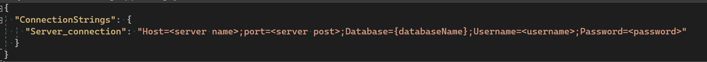

Valghalla tools
====================

Valghalla tools is a simple command line application that can be run as an executable on the target machine. 
The purpose of this application is to simplify some tasks that is needed to add/maintain new municipalities. 
The application has three different commands that will be described here. 
To install the application on the target machine simply publish the application from visual studio to a folder, then move all the published file to a folder. 

Then to use the tools simply navigate to the folder where you put the files from a command prompt and write .\Valghalla.Tools.exe -h for more information on each command. 

The tools have a appsettings.json that needs the connection string to the server with credentials. 
Instead of the actual database name it should be {databaseName} which will later be replaced with the input database name. 

The available commands are the following: 

*	updateSingle, Updates one database on the giver database server. Needs an option -d which should be the database to update. 

*	addExternalAuthCert, Inserts the external authentication certificate for a specific municipality. Needs -d for database name, -f file path to the certificate that should be uploaded and finally -p for the password of the certificate. The command will upload and add all the necessary info to the given database. Will not update already uploaded certificate. 

*	addInternalAuthCert, Inserts the internal authentication certificate for a specific municipality. Needs -d for database name, -f file path to the certificate that should be uploaded and finally -p for the password of the certificate. The command will upload and add all the necessary info to the given database. Will not update already uploaded certificate. 
